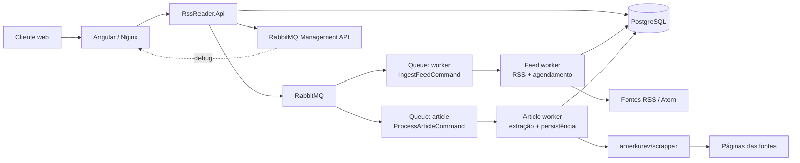
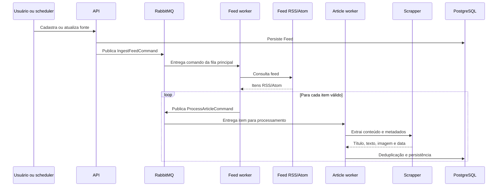
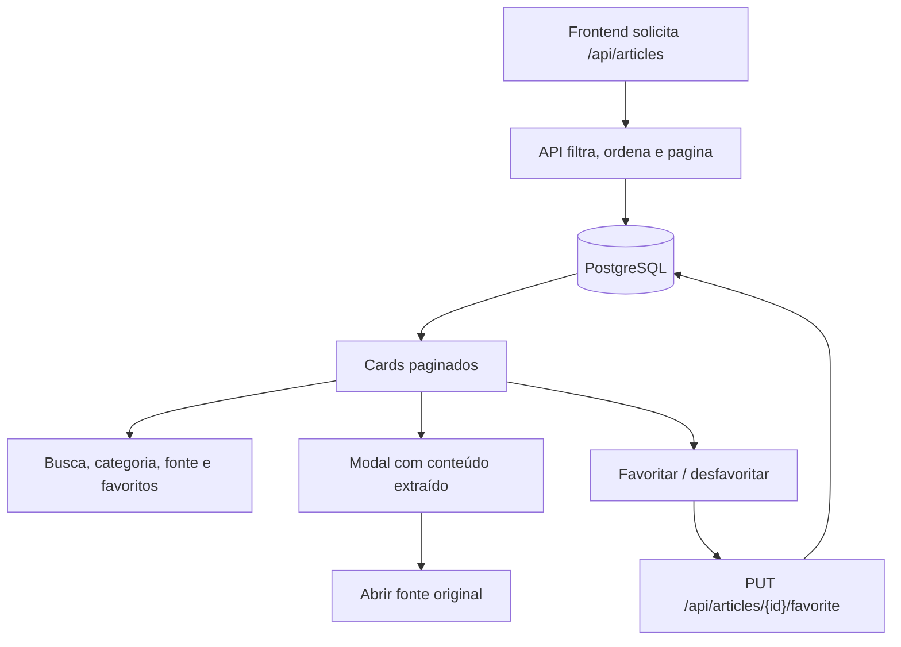

# RSS Reader

[](https://github.com/codespaces/new?hide_repo_select=true&ref=main)

[](https://github.com/avmesquita/rss-reader-rabbitmq-rebus-scrapper/actions/workflows/ci.yml)

[](https://github.com/avmesquita/rss-reader-rabbitmq-rebus-scrapper/actions/workflows/docker.yml)

[](https://github.com/avmesquita/rss-reader-rabbitmq-rebus-scrapper/actions/workflows/pages.yml)

---

Arquitetura modular para coleta e leitura de feeds RSS/Atom, extração de conteúdo em fila e consulta por meio do Angular sobre PostgreSQL.

## Screenshot


## Executar

O projeto combina uma API ASP.NET Core, um worker de ingestão, um worker dedicado a artigos e uma camada de apresentação em Angular. A solução foi desenhada para separar duas responsabilidades bem definidas:

- leitura e agendamento dos feeds
- extração, deduplicação e persistência dos artigos

Essa divisão é implementada com RabbitMQ como broker de mensagens e Rebus como biblioteca de mensageria, permitindo desacoplamento entre a API, o worker de feeds e o article worker. O padrão elimina acoplamento síncrono entre produção e processamento, torna a ingestão tolerante a picos de carga e facilita a escalabilidade horizontal por filas e workers independentes.

## Começo rápido

1. Crie o arquivo de ambiente local a partir do exemplo:
   ```bash
   cp .env.example .env
   ```
2. Ajuste as credenciais, portas e parâmetros de infraestrutura conforme o ambiente local ou de homologação.
3. Suba a stack:
   ```bash
   docker compose up --build
   ```
4. Acesse os serviços:
   - Frontend: http://localhost:6660
   - API/Swagger: http://localhost:6661/swagger
   - RabbitMQ Management: http://localhost:6664
   - pgAdmin: http://localhost:7771
   - Adminer: http://localhost:7772

> O arquivo `.env` controla portas, credenciais, filas e ajustes de processamento. O Compose usa essas variáveis para conectar a API, os workers, o PostgreSQL e o RabbitMQ.

## Arquitetura

A solução foi concebida como uma arquitetura orientada a eventos, com separação clara entre a camada de entrada, processamento assíncrono e consulta de dados. A API ASP.NET Core atua como componente de orquestração e exposição de serviços, enquanto a infraestrutura de mensageria assume a responsabilidade de desacoplamento entre a produção de tarefas e sua execução efetiva.



### Camadas e responsabilidades

- Camada de apresentação: Angular + Nginx, responsável pela interface de consulta e interação do usuário.
- Camada de aplicação: API ASP.NET Core, responsável por registrar fontes, consultar artigos e expor operações de leitura.
- Camada de integração: RabbitMQ com Rebus, responsável pelo envio de comandos assíncronos e pelo desacoplamento entre produtores e consumidores.
- Camada de processamento: feed worker e article worker, responsáveis pela leitura dos feeds, publicação dos itens e extração do conteúdo completo.
- Camada de persistência: PostgreSQL, responsável pelo armazenamento das fontes, metadados e artigos extraídos.

### Fluxo operacional

1. O usuário cadastra ou atualiza uma fonte na API.
2. A API registra o feed em PostgreSQL e publica um comando `IngestFeedCommand` para a fila principal do RabbitMQ por meio do Rebus.
3. O feed worker consome a mensagem, lê o conteúdo do RSS/Atom, valida os itens e publica um `ProcessArticleCommand` para cada artigo relevante na fila de artigos.
4. O article worker executa a extração do conteúdo completo, aplica deduplicação, normaliza os dados e persiste os registros em PostgreSQL.
5. O frontend consulta o resultado final por meio da API, sem depender do processamento assíncrono em tempo real das filas.

Esse padrão reduz a latência da API, melhora a resiliência do sistema frente a picos de carga e permite dimensionar o processamento em função da complexidade e do volume dos feeds.

## Configuração do ambiente

Copie o arquivo `.env.example` para `.env` e ajuste os valores antes de iniciar a stack local. O Docker Compose injeta essas variáveis em todos os serviços e também controla o comportamento dos workers.

### Portas e serviços

- `FRONTEND_HOST_PORT`, `API_HOST_PORT`, `SCRAPPER_HOST_PORT`, `RABBITMQ_HOST_PORT`, `RABBITMQ_MANAGEMENT_HOST_PORT`, `POSTGRES_HOST_PORT`, `PGADMIN_HOST_PORT`, `ADMINER_HOST_PORT`: portas expostas na máquina host.
- `FRONTEND_PORT`, `API_PORT`, `SCRAPPER_PORT`, `RABBITMQ_PORT`, `RABBITMQ_MANAGEMENT_PORT`, `POSTGRES_PORT`, `PGADMIN_PORT`, `ADMINER_PORT`: portas internas da rede Docker.
- `POSTGRES_HOST`, `RABBITMQ_HOST`, `SCRAPPER_HOST`: nomes dos serviços usados pelos containers.

### Credenciais e infraestrutura

- `POSTGRES_DB`, `POSTGRES_USER`, `POSTGRES_PASSWORD`: banco e credenciais do PostgreSQL.
- `RABBITMQ_USER`, `RABBITMQ_PASSWORD`: credenciais do RabbitMQ.
- `RABBITMQ_WORKER_QUEUE`: fila principal usada pela API para despachar a ingestão de feeds.
- `RABBITMQ_ARTICLE_QUEUE`: fila dedicada ao processamento de artigos e extração do scrapper.
- `PGADMIN_DEFAULT_EMAIL`, `PGADMIN_DEFAULT_PASSWORD`: credenciais do pgAdmin.
- `DEBUG_ENABLED`: habilita o painel operacional e endpoints de debug na API. Deve permanecer desligado em ambientes públicos.

### Ajustes de ingestão e processamento

- `INGESTION_WORKERS`: número de workers Rebus na fila principal de feeds.
- `INGESTION_INTERVAL_HOURS`: intervalo em horas entre execuções agendadas.
- `INGESTION_SCHEDULER_ENABLED`: ativa ou desativa o agendamento automático de feeds.
- `SCRAPPER_MAX_PARALLELISM`: paralelismo do scrapper por instância.
- `ARTICLE_WORKERS`: número de workers da fila de artigos.
- `STORE_IMAGES_AS_BASE64`: armazena imagens em base64 quando definido como `true`.
- `IMAGE_MAX_BYTES`: limite máximo em bytes para imagens aceitas antes do descarte.

> Em geral, não altere `POSTGRES_HOST`, `RABBITMQ_HOST` e `SCRAPPER_HOST` sem ajustar também o `docker-compose.yml`; esses nomes são usados pela rede interna do Compose e pelos serviços que se conectam entre si.

## Fluxos de processamento

### Ingestão de feeds



### Concorrência e escalabilidade

A arquitetura usa RabbitMQ + Rebus como camada de integração assíncrona e dois níveis de paralelismo para isolar cargas distintas:

- `INGESTION_WORKERS`: aumenta o número de workers Rebus na fila de feeds.
- `ARTICLE_WORKERS`: aumenta o número de workers Rebus na fila de artigos.
- `SCRAPPER_MAX_PARALLELISM`: limita a quantidade de extrações simultâneas por instância do scrapper.
- `INGESTION_SCHEDULER_ENABLED`: liga ou desliga o agendador periódico de checagem.

Essa combinação permite escalar o throughput sem misturar a carga de leitura do feed com a carga de extração de conteúdo, mantendo cada fila com comportamento e limites de concorrência independentes.

### Consulta e leitura



A consulta permite ordenar por data de publicação ou coleta e limitar o período por janela temporal, como 24 horas, 7 dias ou 30 dias.

## Operação e troubleshooting

### A API não consegue se conectar ao PostgreSQL ou ao RabbitMQ
- Verifique se o arquivo `.env` foi criado a partir do `.env.example`.
- Confirme se `POSTGRES_HOST`, `RABBITMQ_HOST` e `SCRAPPER_HOST` coincidem com os nomes dos serviços em `docker-compose.yml`.
- Se houver mudança de credenciais, execute `docker compose down -v && docker compose up --build`.

### A ingestão não dispara automaticamente
- Confirme que `INGESTION_SCHEDULER_ENABLED=true`.
- Verifique se a fonte está ativa e se `NextScheduledAt` está sendo atualizado corretamente.
- Consulte o RabbitMQ Management em http://localhost:6664 para validar a fila principal.

### Os artigos não são processados
- Verifique se `RABBITMQ_ARTICLE_QUEUE` está correto e se o `article worker` está em execução.
- Ajuste `ARTICLE_WORKERS` e `SCRAPPER_MAX_PARALLELISM` de acordo com a carga do ambiente.
- Revise os logs do worker para identificar falhas de extração, deduplicação ou persistência.

### O painel de debug não aparece
- Defina `DEBUG_ENABLED=true` no `.env`.
- Reinicie a API e o frontend.
- O recurso deve permanecer desligado em ambientes públicos.

## Desenvolvimento

O repositório inclui uma configuração de GitHub Codespaces em `.devcontainer`. Depois de abrir o Codespace, o ambiente restaura a solução .NET e instala as dependências do Angular automaticamente. Para subir a infraestrutura local, use `docker compose up --build`.

O workflow `CI` valida o build Release da solução .NET, o type-check/build do Angular e a configuração do Docker Compose. O workflow `Deploy frontend to GitHub Pages` publica apenas o frontend estático na branch principal. A API, o PostgreSQL, o RabbitMQ e o scrapper continuam precisando ser hospedados separadamente; sem uma API pública configurada, a página publicada serve apenas o shell do frontend.

O workflow `Docker Images` constrói e publica as imagens no Docker Hub, na conta `avmesquita`, somente em push para a branch padrão. Configure no repositório os secrets `DOCKERHUB_USERNAME` e `DOCKERHUB_TOKEN`, usando um Access Token do Docker Hub com permissão de `Read & Write`.


## Parâmetros do environment por serviço

A tabela abaixo reúne os principais parâmetros usados pelo Docker Compose e pelos serviços da stack. Ela foi organizada por tipo de responsabilidade para facilitar a configuração e a manutenção do ambiente.

### Infraestrutura e portas

| Variável | Serviço | Tipo | Descrição | Valor padrão |
| --- | --- | --- | --- | --- |
| `FRONTEND_HOST_PORT` | frontend | porta | Porta exposta do frontend na máquina host | `6660` |
| `API_HOST_PORT` | api | porta | Porta exposta da API na máquina host | `6661` |
| `SCRAPPER_HOST_PORT` | scrapper | porta | Porta exposta do scrapper na máquina host | `6662` |
| `RABBITMQ_HOST_PORT` | rabbitmq | porta | Porta AMQP exposta na máquina host | `6663` |
| `RABBITMQ_MANAGEMENT_HOST_PORT` | rabbitmq | porta | Porta do painel de gestão do RabbitMQ | `6664` |
| `POSTGRES_HOST_PORT` | postgres | porta | Porta exposta do PostgreSQL na máquina host | `6665` |
| `PGADMIN_HOST_PORT` | pgadmin | porta | Porta exposta do pgAdmin | `7771` |
| `ADMINER_HOST_PORT` | adminer | porta | Porta exposta do Adminer | `7772` |
| `FRONTEND_PORT` | frontend | porta interna | Porta interna do frontend no container | `80` |
| `API_PORT` | api | porta interna | Porta interna da API no container | `8080` |
| `SCRAPPER_PORT` | scrapper | porta interna | Porta interna do scrapper | `3000` |
| `RABBITMQ_PORT` | rabbitmq | porta interna | Porta AMQP do RabbitMQ | `5672` |
| `RABBITMQ_MANAGEMENT_PORT` | rabbitmq | porta interna | Porta do management do RabbitMQ | `15672` |
| `POSTGRES_PORT` | postgres | porta interna | Porta interna do PostgreSQL | `5432` |
| `PGADMIN_PORT` | pgadmin | porta interna | Porta interna do pgAdmin | `80` |
| `ADMINER_PORT` | adminer | porta interna | Porta interna do Adminer | `8080` |

### Serviços e conectividade

| Variável | Serviço | Tipo | Descrição | Valor padrão |
| --- | --- | --- | --- | --- |
| `POSTGRES_HOST` | api / worker | hostname | Nome do serviço do PostgreSQL dentro da rede Docker | `rss_postgres` |
| `RABBITMQ_HOST` | api / worker | hostname | Nome do serviço do RabbitMQ dentro da rede Docker | `rss_rabbitmq` |
| `SCRAPPER_HOST` | worker | hostname | Nome do serviço do scrapper dentro da rede Docker | `rss_scrapper` |

### PostgreSQL

| Variável | Serviço | Tipo | Descrição | Valor padrão |
| --- | --- | --- | --- | --- |
| `POSTGRES_DB` | postgres | credencial | Nome do banco | `rssreader` |
| `POSTGRES_USER` | postgres | credencial | Usuário do PostgreSQL | `rssreader` |
| `POSTGRES_PASSWORD` | postgres | credencial | Senha do PostgreSQL | `rssreader` |

### RabbitMQ e filas

| Variável | Serviço | Tipo | Descrição | Valor padrão |
| --- | --- | --- | --- | --- |
| `RABBITMQ_USER` | rabbitmq | credencial | Usuário do RabbitMQ | `rssreader` |
| `RABBITMQ_PASSWORD` | rabbitmq | credencial | Senha do RabbitMQ | `rssreader` |
| `RABBITMQ_WORKER_QUEUE` | api / worker | fila | Fila principal de ingestão de feeds | `rss-reader-worker` |
| `RABBITMQ_ARTICLE_QUEUE` | article worker | fila | Fila de processamento de artigos | `rss-reader-article-worker` |

### Aplicação e processamento

| Variável | Serviço | Tipo | Descrição | Valor padrão |
| --- | --- | --- | --- | --- |
| `DEBUG_ENABLED` | api / frontend | feature flag | Habilita painel operacional e endpoints de debug | `false` |
| `INGESTION_WORKERS` | worker | concorrência | Número de workers Rebus para a fila principal | `2` |
| `INGESTION_INTERVAL_HOURS` | worker | agendamento | Intervalo em horas entre ciclos de ingestão | `1` |
| `INGESTION_SCHEDULER_ENABLED` | worker | agendamento | Ativa ou desativa o agendamento automático de feeds | `true` |
| `SCRAPPER_MAX_PARALLELISM` | worker | concorrência | Limite de paralelismo do scrapper por worker | `2` |
| `ARTICLE_WORKERS` | article worker | concorrência | Número de workers Rebus para a fila de artigos | `2` |
| `STORE_IMAGES_AS_BASE64` | worker | processamento | Armazena imagens em base64 no banco | `false` |
| `IMAGE_MAX_BYTES` | worker | processamento | Limite máximo em bytes para imagens aceitas | `2000000` |

### Ferramentas de administração

| Variável | Serviço | Tipo | Descrição | Valor padrão |
| --- | --- | --- | --- | --- |
| `PGADMIN_DEFAULT_EMAIL` | pgadmin | credencial | E-mail inicial do pgAdmin | `admin@rssreader.com` |
| `PGADMIN_DEFAULT_PASSWORD` | pgadmin | credencial | Senha inicial do pgAdmin | `rssreader` |

> Para uso local, mantenha as credenciais em `.env` e nunca exponha valores sensíveis em repositórios públicos. Em ambientes compartilhados, prefira secrets do ambiente ou do seu orquestrador.

## Versionamento

Para publicar uma versão, crie e envie uma tag semântica no formato `vMAJOR.MINOR.PATCH`:
Imagens publicadas:

- `avmesquita/rss-reader-api`
- `avmesquita/rss-reader-worker`
- `avmesquita/rss-reader-frontend`

```bash
git tag v1.0.0
git push origin v1.0.0
```

O workflow publica as três imagens com as tags `1.0.0`, `1.0`, `1` e uma tag baseada no commit. A tag `latest` continua sendo atualizada somente pela branch padrão.

## Agradecimentos

Este projeto utiliza e agradece aos seguintes projetos e comunidades:

- [amerkurev/scrapper](https://github.com/amerkurev/scrapper): serviço utilizado para extrair o conteúdo e os metadados completos dos artigos.
- [Rebus](https://github.com/rebus-org/Rebus): biblioteca utilizada para implementar a comunicação assíncrona entre a API e os workers.
- [Rebus.RabbitMq](https://github.com/rebus-org/Rebus.RabbitMq): transporte RabbitMQ utilizado com o Rebus.
- [RabbitMQ](https://www.rabbitmq.com/): broker de mensagens utilizado pela aplicação.

Consulte os repositórios oficiais para obter os créditos, licenças e termos de uso de cada projeto.
