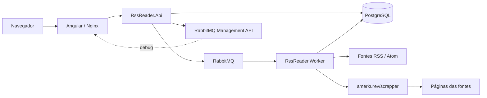
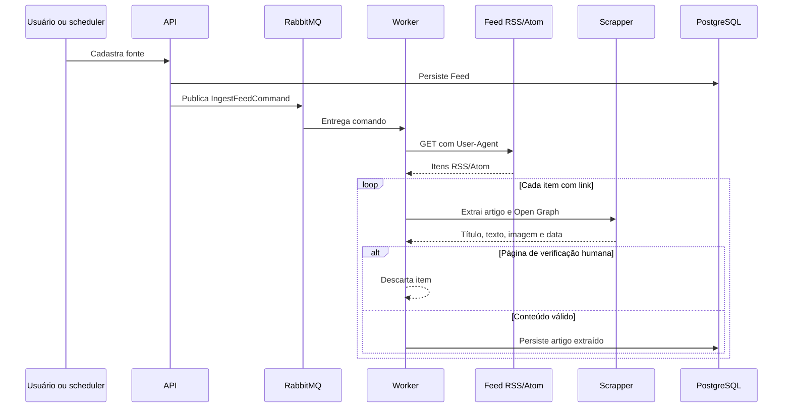

# RSS Reader

[](https://github.com/codespaces/new?hide_repo_select=true&ref=main)
[](https://github.com/avmesquita/rss/actions/workflows/ci.yml)
[](https://github.com/avmesquita/rss/actions/workflows/pages.yml)
[](https://github.com/avmesquita/rss/actions/workflows/docker.yml)

Arquitetura modular para coletar artigos RSS com Rebus/RabbitMQ, extrair conteúdo pelo `amerkurev/scrapper`, persistir no PostgreSQL e consultar pelo Angular.

## Executar

```bash
docker compose up --build
```

- Frontend: http://localhost:6660
- API/Swagger: http://localhost:6661/swagger
- Scrapper: http://localhost:6662
- RabbitMQ: http://localhost:6664 (`rssreader` / `rssreader`)
- pgAdmin: http://localhost:7771 (`admin@rssreader.com` / `rssreader`)
- Adminer: http://localhost:7772

Para o pgAdmin ou Adminer, conecte ao servidor PostgreSQL usando host `rss_postgres`, porta `5432`, banco `rssreader`, usuário `rssreader` e a senha definida em `POSTGRES_PASSWORD` no `.env`. O host `localhost` só deve ser usado ao conectar a partir da máquina local, não de dentro dos containers.

As portas, nomes de serviço e credenciais de desenvolvimento ficam no arquivo `.env` na raiz. O Compose injeta esses valores na API e no worker; os arquivos `appsettings.json` não contêm parâmetros de infraestrutura.

A API cadastra um concentrador em `POST /api/feeds`. O comando é publicado no RabbitMQ; o worker lê cada item do RSS, chama `/api/article?url=...&cache=false` e grava o resultado.

A tabela `Articles` usa somente chave técnica e índice de data. Não há índice único por URL, título, GUID ou conteúdo: execuções repetidas preservam todas as ocorrências.

O worker agenda uma nova leitura de todas as fontes ativas imediatamente ao iniciar e depois a cada 24 horas. O intervalo pode ser alterado com `INGESTION_INTERVAL_HOURS` no `.env`.

Para habilitar o painel operacional no frontend, defina `DEBUG_ENABLED=true`. A API passa a expor `/api/debug`, que consulta as filas de erro/dead-letter no endpoint de gerenciamento do RabbitMQ e mantém os 50 erros mais recentes da API em memória. Deixe essa opção desativada em ambientes públicos.

## Fluxos

### Arquitetura



### Ingestão



### Consulta e leitura


## Desenvolvimento

O repositório inclui uma configuração de GitHub Codespaces em `.devcontainer`. Depois de abrir o Codespace, o ambiente restaura a solução .NET e instala as dependências do Angular automaticamente. Para subir a infraestrutura local, use `docker compose up --build`.

O workflow `CI` valida o build Release da solução .NET, o type-check/build do Angular e a configuração do Docker Compose. O workflow `Deploy frontend to GitHub Pages` publica apenas o frontend estático na branch principal. A API, o PostgreSQL, o RabbitMQ e o scrapper continuam precisando ser hospedados separadamente; sem uma API pública configurada, a página publicada serve apenas o shell do frontend.

O workflow `Docker Images` constrói e publica as imagens no Docker Hub, na conta `avmesquita`, somente em push para a branch padrão. Configure no repositório os secrets `DOCKERHUB_USERNAME` e `DOCKERHUB_TOKEN`, usando um Access Token do Docker Hub com permissão de `Read & Write`.

Imagens publicadas:

- `avmesquita/rss-reader-api`
- `avmesquita/rss-reader-worker`
- `avmesquita/rss-reader-frontend`
